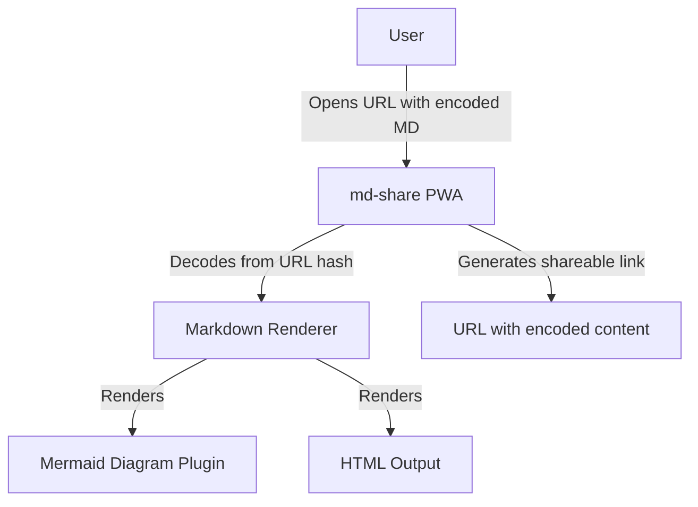

# System Diagram

```mermaid
graph TD
    User[User] -->|Opens URL with encoded MD| App[md-share PWA]
    App -->|Decodes from URL hash| Renderer[Markdown Renderer]
    Renderer -->|Renders| MermaidPlugin[Mermaid Diagram Plugin]
    Renderer -->|Renders| HTMLOutput[HTML Output]
    App -->|Generates shareable link| ShareURL[URL with encoded content]
```
