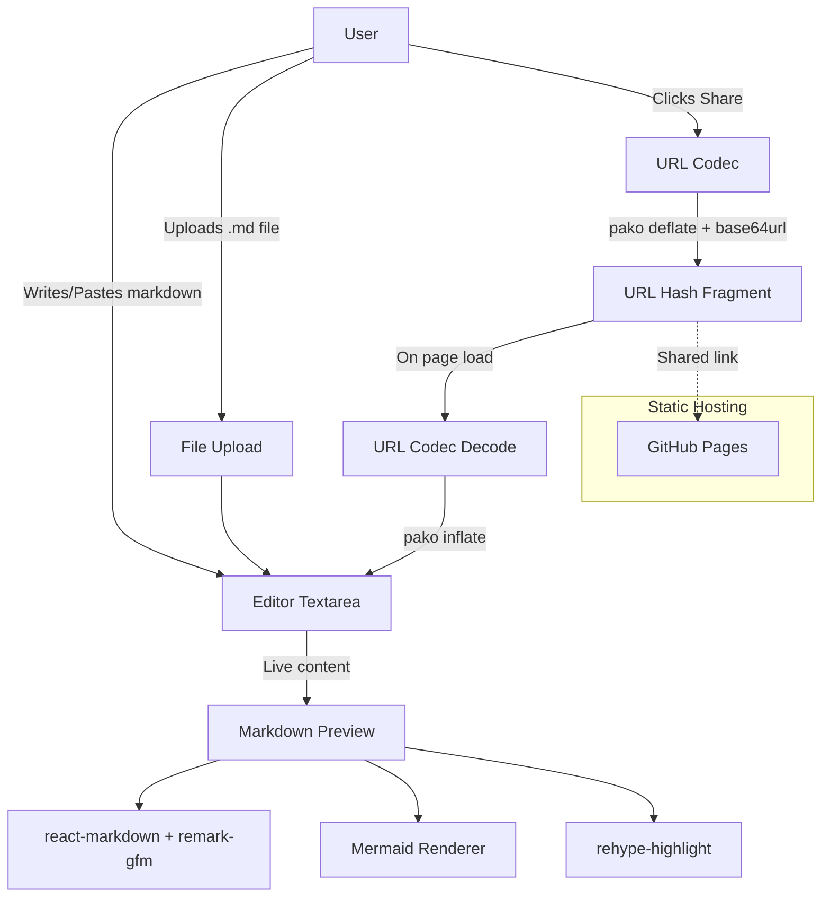

# System Diagram

```mermaid
graph TD
    User[User] -->|Writes/Pastes markdown| Editor[Editor Textarea]
    User -->|Uploads .md file| FileUpload[File Upload]
    FileUpload --> Editor
    Editor -->|Live content| Preview[Markdown Preview]
    Preview --> ReactMarkdown[react-markdown + remark-gfm]
    Preview --> MermaidRenderer[Mermaid Renderer]
    Preview --> SyntaxHighlight[rehype-highlight]
    User -->|Clicks Share| Encoder[URL Codec]
    Encoder -->|pako deflate + base64url| URLHash[URL Hash Fragment]
    URLHash -->|On page load| Decoder[URL Codec Decode]
    Decoder -->|pako inflate| Editor
    
    subgraph Static Hosting
        GHPages[GitHub Pages]
    end
    
    URLHash -.->|Shared link| GHPages
```
